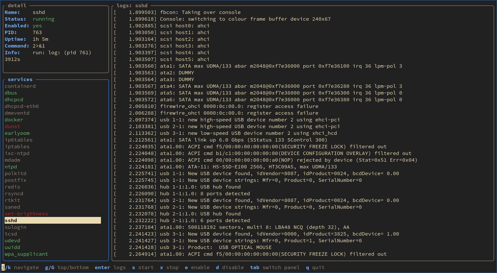

# lazy-init

A lazygit-style TUI for managing init system services.



Services are colored by status: green (running), red (down), dim (disabled).

## Build

Requires Go 1.25+.

```sh
make            # auto-detects init system
make INIT=runit # force runit
make INIT=systemd # force systemd
```

Or build manually:

```sh
go build -tags runit -o lazyinit ./cmd/lazy-init/
go build -tags systemd -o lazyinit ./cmd/lazy-init/
```

## Install

```sh
sudo make install          # installs to /usr/local/bin/
sudo make install PREFIX=/usr  # installs to /usr/bin/
sudo make uninstall        # removes the binary
```

## Usage

```sh
sudo lazyinit
```

Root is required to read service status and control services.

## Key Bindings

### Services panel

| Key | Action |
|-----|--------|
| `j` / `↓` | Cursor down (cyclic) |
| `k` / `↑` | Cursor up (cyclic) |
| `g` | Go to first service |
| `G` | Go to last service |
| `enter` | Load logs for selected service |
| `s` | Start service |
| `x` | Stop service |
| `e` | Enable service (start on boot) |
| `d` | Disable service |
| `a` | Add a new service (prompts for name, opens editor) |
| `r` | Remove selected service (with confirmation) |
| `E` | Edit service file in `$EDITOR` |

### Logs panel

| Key | Action |
|-----|--------|
| `j` / `↓` | Scroll down |
| `k` / `↑` | Scroll up |
| `g` | Go to top |
| `G` | Go to bottom |

### Global

| Key | Action |
|-----|--------|
| `tab` | Switch panel focus |
| `q` / `ctrl+c` | Quit |

## Detail Panel

The detail panel shows information about the selected service:

- **Name** - service name
- **Status** - current state (running, down, disabled, etc.)
- **Enabled** - whether the service starts on boot
- **PID** - process ID (when running)
- **Uptime** - how long the service has been running
- **Command** - the command the service executes
- **Info** - additional state (e.g. log process info, want state)

The service list and detail panel auto-refresh every 2 seconds. Logs live-tail when scrolled to the bottom.

## Service Management

- **Add** (`a`) - prompts for a service name, creates a template service file, then opens it in `$EDITOR` for you to fill in the command (runit: `/etc/sv/<name>/run` + log script, systemd: `/etc/systemd/system/<name>.service`)
- **Remove** (`r`) - stops and disables the service, then deletes its files
- **Edit** (`E`) - opens the service file in your `$EDITOR` (defaults to `vi`), then refreshes the service list on return

## Supported Init Systems

- **runit** - reads from `/etc/sv` (available) and `/var/service` (enabled), uses `sv` for control
- **systemd** - uses `systemctl` and `journalctl`

### Adding a new init system

1. Create `adapter/<name>/manager.go` with a build tag, implementing `core.ServiceManager`
2. Create `cmd/lazy-init/<name>.go` with the same build tag, providing `newManager()`
3. Add the init system detection to the `Makefile` `INIT` auto-detection line
